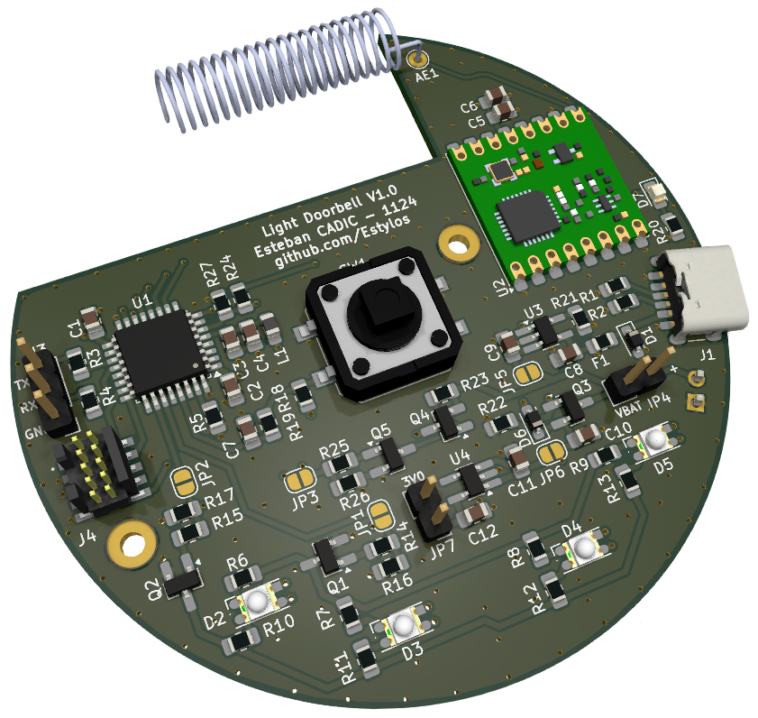
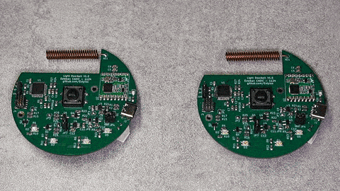

# Light Doorbell Hardware

This repository contains the KiCad design files (schematics and 4-layer circular PCB) for the Light Doorbell prototype: a **battery-powered, LED-signaling doorbell** based on a **STM32L051K8T6** microcontroller and **RFM69HCW** 433 MHz radio module.

A light doorbell is useful in many situations: notifying a user wearing headphones, assisting people with hearing impairments, or simply providing a silent visual alert...

## Overview

The prototype operates both as a transmitter and receiver.  
When the central button is pressed, it sends a coded message to another board listening on the same frequency. Upon receiving the message, the board flashes its dual-color LEDs, green or red, depending on the battery level.

The device is rechargeable via a USB-C connector, and works with a range of several tens of meters in open space.

## Features

- **Ultra-low-power STM32L051K8T6** ARM Cortex-M0+, 64 KB Flash, 8 KB RAM
- **RFM69HCW** 433 MHz transceiver module
- **Li-ion / Li-po battery** charger and management IC
- **3.0V LDO voltage regulator** to step down USB or battery voltage
- **Load sharing circuit** to seamlessly switch power source between USB and battery
- **Battery voltage monitoring**
- **433 MHz helical antenna**
- **Dual-color LEDs**, green and red for visual feedback
- **USB-C connector** for charging
- **Large mechanical push-button**
- **10-pin ARM SWD debug / programming port**
- **UART port** for optional serial communication
- **Multiple test points and jumpers** for current measurements, debug, and isolation
- Designed for **hand soldering** and **easy prototyping**
- Optimized for **low power consumption**

The current version focuses on development and testing. A future version could be further miniaturized by removing debug features and using smaller components...

## Related projects and documentation

- **[Light Doorbell SW](https://github.com/Estylos/Light-Doorbell-SW): Firmware of the project, based on the STM32 CubeHAL**  
- [STM32L051K8T6 Datasheet](https://www.st.com/en/microcontrollers-microprocessors/stm32l051k8.html)  
- [RFM69HCW Datasheet](https://cdn.sparkfun.com/datasheets/Wireless/General/RFM69HCW-V1.1.pdf)  
- [Adafruit Feather M0 Radio with RFM69 Packet Radio](https://learn.adafruit.com/adafruit-feather-m0-radio-with-rfm69-packet-radio/overview)  
- [Microchip (AN1149) - Designing A Li-Ion Battery Charger and Load Sharing System With Microchip’s Stand-Alone Li-Ion Battery Charge Management Controller](https://ww1.microchip.com/downloads/en/appnotes/01149c.pdf)  
- [Zak’s Electronics Blog - A Lithium Battery Charger with Load Sharing.](https://blog.zakkemble.net/a-lithium-battery-charger-with-load-sharing/)  
- [Hackaday - Embed with Elliot: Debounce your Noisy Buttons, Part I.](https://hackaday.com/2015/12/09/embed-with-elliot-debounce-your-noisy-buttons-part-i/)  
- [RefCircruit - Standard Simplest Battery Voltage Monitoring Circuit. ](https://refcircuit.com/articles/854-standard-simplest-battery-voltage-monitoring-circuit-engineering-schematic-solutions.html)